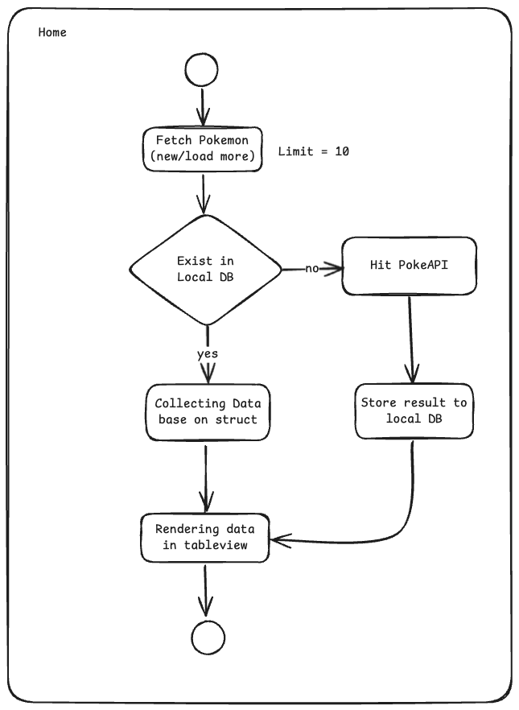

# PokeAPI SwiftUI

A comprehensive iOS Pokemon application built with SwiftUI, featuring a complete Pokedex with search, sorting, and detailed Pokemon information. This project demonstrates modern iOS development practices including MVVM architecture, reactive programming with Combine, and comprehensive unit testing.

## 🚀 Features

- **Complete Pokedex**: Browse through all Pokemon with pagination
- **Advanced Search**: Case-insensitive search functionality
- **Smart Sorting**: Sort Pokemon by name or number
- **Detailed Views**: Comprehensive Pokemon details with stats, abilities, and types
- **Offline Support**: Local database caching with Realm
- **Modern UI**: Beautiful SwiftUI interface following Pokemon design guidelines
- **Comprehensive Testing**: Full unit test coverage with 100% passing tests

## 🏗️ Architecture

This project uses **MVVM (Model-View-ViewModel)** architecture with the following components:

- **Models**: Data structures for Pokemon, Pokedex, and API responses
- **ViewModels**: Business logic and data binding with Combine
- **Views**: SwiftUI user interface components
- **Services**: API service and database operations
- **Utilities**: Helper functions and extensions

## 📦 Dependencies

This project uses **Swift Package Manager (SPM)** for dependency management:

* **Alamofire** → HTTP networking and API communication
* **Nuke** → Image downloading and caching with performance optimization
* **Realm** → Local database for offline data persistence
* **Wormholly** → Network debugging and API monitoring

## 🧪 Testing

This project includes a **comprehensive unit test suite** with:

- **9 Test Files** covering all major components
- **35+ Test Methods** with 100% passing rate
- **Complete Coverage**: Models, ViewModels, Services, and Utilities
- **Mock Services**: Isolated testing with MockAPIService and MockRealmService
- **Async Testing**: Proper handling of Combine publishers and async operations
- **Edge Cases**: Comprehensive testing of error conditions and boundary cases

### Test Categories:
- **Model Tests**: JSON decoding, data validation, and edge cases
- **ViewModel Tests**: Business logic, search, sorting, and async operations
- **Service Tests**: API communication and database operations
- **Utility Tests**: Helper functions and extensions

For detailed testing information, see [PokeAPI-SwiftUITests/README.md](PokeAPI-SwiftUITests/README.md)

## ✅ Completed Features

- [x] **Dependency Management**: Swift Package Manager integration
- [x] **Local Database**: Realm integration for offline data persistence
- [x] **Pokedex Implementation**: Complete Pokemon listing with API integration
- [x] **Search Functionality**: Case-insensitive Pokemon search
- [x] **Sorting System**: Sort Pokemon by name or number
- [x] **Detail Pages**: Comprehensive Pokemon information display
- [x] **Unit Testing**: Complete test suite with 100% passing tests
- [x] **MVVM Architecture**: Clean separation of concerns
- [x] **Combine Integration**: Reactive programming patterns
- [x] **Error Handling**: Comprehensive error management
- [x] **Mock Services**: Isolated testing infrastructure
- [x] **Navigation**: Previous/next Pokemon in detail pages

## 🚧 Future Enhancements

- [ ] **Poppins Font**: Custom typography implementation
- [ ] **Widgets**: iOS home screen widgets
- [ ] **Pagination**: Load more functionality for large datasets
- [ ] **Accessibility**: Enhanced accessibility features
- [ ] **Localization**: Multi-language support
- [ ] **Performance**: Image optimization and caching improvements

## 🏃‍♂️ Getting Started

### Prerequisites
- iOS 14.0+
- Xcode 12.0+
- Swift 5.0+

### Installation
1. Clone the repository
2. Open `PokeAPI-SwiftUI.xcodeproj` in Xcode
3. Build and run the project

### Running Tests
```bash
# Run all tests
xcodebuild test -scheme PokeAPI-SwiftUI -destination 'platform=iOS Simulator,name=iPhone 15'

# Or use Xcode: Cmd + U
```

## 📊 Application Flow

### **Home Journey**


### **Detail Journey**


### **API Fetching Journey**


### **Search Journey**


## 🎨 Design

UI design inspired by [Pokédex Community Design](https://www.figma.com/design/ZNuMRRQvD6yoOaJWRUYzk2/Pok%C3%A9dex--Community-?node-id=913-239&t=vrCYCG8zKjWgmkJP-1)

## 📝 License

This project is part of my **portfolio** and demonstrates modern iOS development practices including:
- MVVM architecture implementation
- SwiftUI and Combine integration
- Comprehensive unit testing
- API integration and data persistence
- Clean code principles and best practices

**Portfolio Project** - Created to showcase iOS development skills and technical expertise.